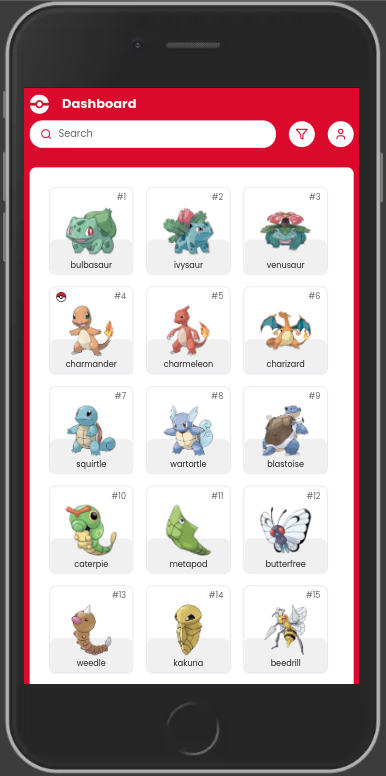

<h3 align="center">
  
  <p align="center">🌎 Gotta fetch 'em all <b>(with JS)</b>!</p>
</h3>

<br />

<p align="center">
  <kbd>
    
  </kbd>
  &nbsp;&nbsp;&nbsp;&nbsp;
  <kbd>
    
  </kbd>
  &nbsp;&nbsp;&nbsp;&nbsp;
  <kbd>
    
  </kbd>
</p>

<br />

# Table of contents

- [Tools versions](#️tools-versions)
- [Environment](#environment)
- [Getting started](#getting-started)
- [Responsiveness](#responsiveness)
- [Current status](#current-status)
- [Design reference](#design-reference)
- [Contributors](#contributors)

# Tools versions

Make sure to install and use required tools:

- NodeJS @ 20.16.0
- NPM @ 10.8.1

# Environment

## Cloning this project

```bash
git clone https://github.com/samuelpietra/pokedex.git
```

## Installing dependencies

This project contains both `ui` and `server` projects. You may want to use two terminal instances in order to test our fullstack experience.

### Backend dependencies

```bash
cd server && npm install
```

### Frontend dependencies

```bash
cd ui && npm install
```

## Creating .env file

By now, only our frontend project will need an environment file to avoid breaking on build due to linting warnings.

```bash
cd ui && cp .env.example .env.local
```

# Getting started

Now you should be able to start running both `ui` and `server` projects.

## Starting backend server

```bash
cd server && npm run dev
```

## Starting frontend server

```bash
cd ui && npm start
```

# Responsiveness

In order to build and scale things faster, most of this project was built with [shadcn](https://ui.shadcn.com) - a clever abstraction of [radix-ui primitives](https://www.radix-ui.com/primitives) styled with [Tailwind CSS](https://tailwindcss.com).

By this way, we could easily apply breaking points for many different screen resolutions. We tried to focus on the same breakpoints that Tailwind advices at their [Responsive Design](https://tailwindcss.com/docs/responsive-design) documentation.

# Current status

- [x] List both Dashboard and Collection
- [x] Sort content by many filters
- [x] Access a single pokémon details
- [x] Ability to mark pokémons as Seen or Captured
- [ ] Better classes distribution
- [ ] Enhanced unit tests and coverage

# Design reference

We are proud to count on the **Figma Community** to inspire and make our project look amazing! You can access the reference project made by [Ricardo Schiniegoski](https://www.figma.com/@ricardohs) by clicking [here](https://www.figma.com/community/file/979132880663340794/pokedex).

# Contributors

<table>
  <tr>
    <td align="center"><a href="https://github.com/samuelpietra"><br /><sub><b>Samuel Pietra</b></sub></a><br /></td>
  </tr>
</table>
